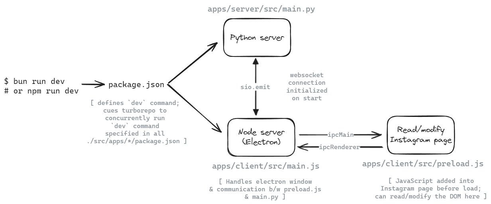

### [Electron](https://www.electronjs.org/) x [Python](https://www.python.org/) [Monorepo](https://turbo.build/) Example for FlikTok Dev Spike

---

## Requirements

- python & pip (tested w/ v3.11.5 but any 3.x should work to get started)
- [node & npm](https://nodejs.org/)
- [bun](https://bun.sh/) (optional; can use `npm` instead, which comes with node; tested w/ v1.1.10)

**NOTE:** bun runs faster than node & npm, but native support for Windows is in beta & may not work as expected there. Would recommend using bun on Linux, macOS or [WSL2](https://learn.microsoft.com/en-us/windows/wsl/install) if on Windows.

## Setup & Usage

```bash
git clone https://github.com/arazzz/fliktok_testing.git && cd fliktok_testing
bun install # or `npm install`
bun dev # or `npm run dev` (runs the app)
```

- Can also use `bun start` (or `npm run start`) to start the app without watching for changes (hot-reloading enabled by default).
- Running the app will simultaneously start the Electron app and the Python server. The real-time communication between them is handled via the [socket.io](https://socket.io/) & [python-socketio](https://python-socketio.readthedocs.io/en/stable/) library for websockets. The project structure follows a typical monorepo setup using [Turbo](https://turbo.build/).
- To stop the app, press `Ctrl+C` in the terminal.

## Overview



- The app consists of two parts: an Electron app (apps/client) and a Python server (apps/server).
  - The Electron app is a simple browser window that loads the Instagram login page, logs in, and then navigates to the Instagram Reels page.
  - The Python server communicates with the Electron app via websockets, detects when a reel is loaded, and picks a random time to switch to a new reel; it then sends that time to the Electron app, which accordingly scrolls to the next reel at the given time.
- Should look something like this:
  

https://github.com/arazzz/fliktok_testing/assets/33709341/339d37cf-ce5e-4393-af55-b33d6c2f1d81


## Details

- Basically, `bun dev` calls the `dev` script specified in the root `package.json`, which triggers `turbo` to run the `dev` script in all `src/apps/*/package.json` (and `src/packages/*/package.json`, albeit not used here) folders.
  1. The `dev` script in `src/apps/server/package.json` invokes `poetry run dev` in the `src/apps/server` folder (specified in the `pyproject.toml` file) to start the Python server (using [FastAPI](https://fastapi.tiangolo.com/)) on `http://localhost:8000` (env vars for HOST & PORT can be specified in `src/packages/config/base.yml` or the usual way via .env files, etc.). The FastAPI server is started using the [uvicorn ASGI server](https://fastapi.tiangolo.com/deployment/manually/), and [python-socketio](https://python-socketio.readthedocs.io/en/stable/) is tagged onto it to handle websocket communication (see `src/apps/server/src/app.py`). The server (when running in dev mode) is started using [nodemon](https://github.com/remy/nodemon), so any changes to the Python code will trigger a server restart.
  - **NOTE**: Poetry is a package manager for Python that handles dependencies, virtual environments, etc. Definitely don't need to use it, but I find it handy in monorepos. Here it creates a local virtual environment in the `src/apps/server/.venv` folder & installs dependencies there, as specified in the `pyproject.toml` file (similarly to how `npm` or `bun` install dependencies into a `node_modules` folder, as specified in `package.json`). Some handy poetry commands if not familiar (**can call these inside the `src/apps/server` folder**):
    - `poetry install`: Installs all dependencies specified in the `pyproject.toml` file.
    - `poetry add <package>`: Installs a package and updates the `pyproject.toml` file.
    - `poetry shell`: Activates the local virtual environment (similar to `source .venv/bin/activate`).
    - `poetry run dev`: Runs the `dev` script specified in `pyproject.toml` file, using the local virtual environment.
  2. The `dev` script in `src/apps/client/src/main.js` folder starts the main Electron app using [Electron](https://www.electronjs.org/). The app is a simple browser window that loads the [Instagram login](https://www.instagram.com/accounts/login/) page (redirects to the [Instagram feed](https://www.instagram.com/) after login / if already logged in). This is also started using [nodemon](https://github.com/remy/nodemon) in dev mode, and any changes to the JavaScript code will trigger a restart of the Electron app. Once the Instagram feed is loaded, the following will occur:
     1. `main.js` will let `preload.js` know that the app is ready to receive messages (the `login-success` message) by sending it to the `preload.js` script via Electron's IPC (inter-process communication) system.
     2. `preload.js` will hear the `login-success` message from `main.js`, redirect to the [Reels page](https://www.instagram.com/reels/), and send the currently playing reel's info (ID, duration, etc.) to `main.js` via the `reels-loaded` event (again via IPC).
     3. `main.js` will hear the `reels-loaded` event from `preload.js`, and send the reel info to the Python server (in `app.py`) via a websocket connection.
     4. `app.py` will hear the `reels-loaded` and use the given reel info (duration, specifically) to pick a random time to switch to a new reel (see `async def loaded_new_reel(sid, data)` in `app.py`). It will then send a message back to `main.js` via the websocket connection, with the time that it picked (in seconds), emitting the `switch-to-new-reel-at-time` message.
     5. `main.js` will hear the `switch-to-new-reel-at-time` message from `app.py`, and give `preload.js` the time that was picked. `preload.js` will then wait for that time to pass, and once it does, it will click scroll to the next reel — which in turn will trigger the `reels-loaded` event (in #3 above) again — and so on.

**Altogether, this app creates a simple loop where the Python server picks a random time to switch reels, and the Electron app scrolls to the next reel at that time.**

## Troubleshooting

- Just noticed— the first time you sign in to Instagram in the electron window, it may not work properly (might get a blank page or an error — can be easily fixed by not making the preload script a module or [changing how it's loaded](https://www.electronjs.org/docs/latest/tutorial/esm) but haven't gotten around to it yet). If this happens, close the app via `Ctrl+C` and run `bun dev` again. Doesn't matter much once you're signed in— just a one-time issue, hopefully.
